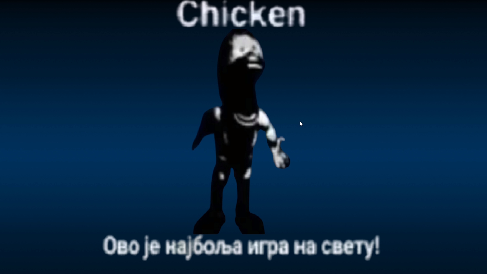
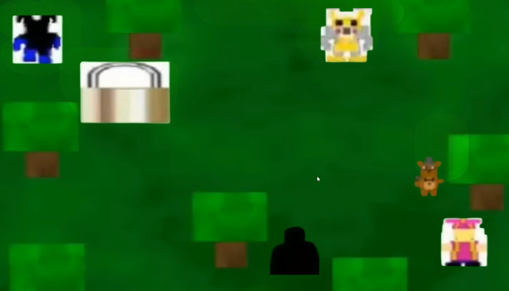

<!--proyect_tittle-->
# 🎮 Proyecto Hobby: Replica Visual del FNaF World Ransomware en Python

<!--proyect_image1_proyect_markdown/image1.gif-->

---

<!--proyect_subtitle_description-->
## ✨ Descripción del Proyecto

<!--proyect_content_description-->
Este proyecto fue desarrollado por puro hobby, con el objetivo de replicar la estética y comportamiento visual del famoso “FNaF World Ransomware”, utilizando **Python** y la librería **Pygame**. Aunque no tiene funcionalidad maliciosa, el proyecto recrea la interfaz, animaciones y transiciones que caracterizan a ese estilo, incluyendo la pantalla de título, la carga inicial y el mapa del juego.

La intención fue explorar el diseño gráfico retro, el manejo de eventos en tiempo real y la lógica de navegación entre escenas, todo dentro de un entorno controlado y seguro.

---

<!--proyect_subtitle_objective-->
## 🎯 Objetivo del Proyecto

<!--proyect_content_objective-->
El objetivo principal fue **recrear la experiencia visual y de navegación** de un entorno inspirado en el FNaF World Ransomware, sin replicar su comportamiento original. Se trató de un ejercicio creativo para practicar el uso de Pygame, la gestión de sprites, animaciones, sonidos y transiciones entre pantallas.

Este proyecto también sirvió como base para entender cómo se estructuran juegos en 2D, cómo se manejan los ciclos de renderizado y cómo se puede simular una experiencia interactiva con recursos gráficos personalizados.

---

<!--proyect_subtitle_functionality-->
## 🧩 Funcionamiento General

<!--proyect_content_functionality-->
La aplicación se compone de tres escenas principales:

1. **Pantalla de título:** Animación inicial con efectos visuales y música de fondo, simulando el estilo original.
2. **Pantalla de carga:** Transición visual con barra de progreso simulada y efectos de sonido.
3. **Mapa del juego:** Vista general del entorno con sprites animados, detección de teclas y navegación básica.

Cada escena está controlada por un bucle principal que gestiona eventos, renderizado y actualizaciones de estado.

<!--proyect_image2_proyect_markdown/image2.png-->

---

<!--proyect_subtitle_designUX-->
## 🖥️ Diseño y Experiencia de Usuario

<!--proyect_content_designUX-->
El diseño se inspira en el estilo retro y glitch del ransomware original, con colores intensos, tipografía pixelada y transiciones abruptas. Se utilizaron sprites personalizados y efectos visuales para reforzar la atmósfera del proyecto.

La experiencia de usuario está pensada para ser visualmente impactante, con una navegación simple pero envolvente. El mapa incluye elementos interactivos y animaciones que simulan movimiento y profundidad.

<!--proyect_image3_proyect_markdown/image3.png-->

---

<!--proyect_subtitle_architecture-->
## 🏗️ Arquitectura Técnica

<!--proyect_content_architecture-->
El proyecto está estructurado en módulos independientes que gestionan cada escena:

- **Motor principal:** Ciclo de juego con control de eventos, FPS y renderizado.
- **Gestión de escenas:** Transiciones entre título, carga y mapa.
- **Sprites y animaciones:** Uso de imágenes `.png` y ciclos de animación con temporizadores.
- **Sonido:** Reproducción de efectos `.wav` y música de fondo.
- **Control de entrada:** Detección de teclas para navegación y simulación de interacción.

Todo el código está escrito en Python, utilizando Pygame como base para gráficos, sonido y eventos.

---

<!--proyect_subtitle_technologies-->
## 🔧 Tecnologías Utilizadas

<!--proyect_content_technologies-->
**Lenguaje de programación:**
- Python 3.x

**Librerías:**
- Pygame  
- OS / Sys (para rutas y control de ejecución)  
- Time (para temporizadores y animaciones)

**Recursos gráficos:**
- Sprites en `.png`  
- Música y efectos en `.wav`  
- Fuentes pixeladas para estilo retro

---

<!--proyect_subtitle_contact-->
## 📬 Contacto

<!--proyect_content_contact-->
**Correo electrónico:**
- vielmassalais023@gmail.com  

**Teléfono:**
- +52 (81) 3233-1206  

**Redes Sociales:**
- GitHub: [@CesarVielmas](https://github.com/CesarVielmas)  
- LinkedIn: [Cesar Vielmas](https://www.linkedin.com/in/cesar-vielmas-324a9b218/)  

---

<!--proyect_subtitle_footer-->
## Proyecto Hobby – FNaF Style

<!--proyect_content_footer-->
Explorando gráficos retro y lógica de juego con Python 🎮  
**Última actualización:** 3 de septiembre de 2025
